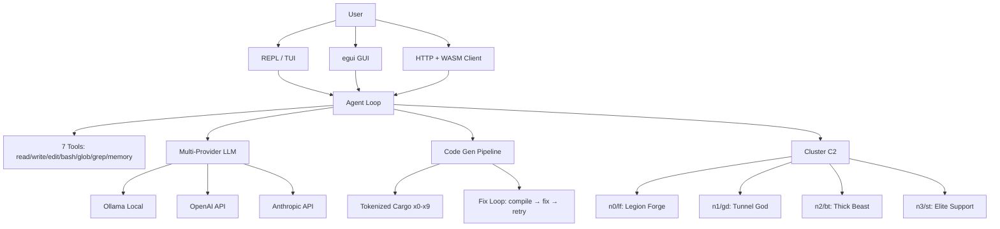

<!-- Unlicense — cochranblock.org -->

# Proof of Artifacts

*Concrete evidence that this project works, ships, and is real.*

> This is not a demo repo. This is a production augment engine. The artifacts below prove it.

## Architecture



## Build Output

| Metric | Value |
|--------|-------|
| Binary size (release) | 27 MB (opt-z, LTO, strip, codegen-units=1, panic=abort) |
| Binary size (before opt) | 54 MB |
| Android .so | 17 MB (arm64-v8a release) |
| Android APK | 17 MB (signed release) |
| Android AAB | 6.6 MB (signed, for Play Store) |
| Lines of Rust | 40,393 across 92 files |
| Public functions | 449 |
| Public types | 170 |
| Tokenized functions | 246 (f0–f376) |
| Tokenized types | 142 (t0–T215) |
| Tokenization coverage | 86.6% (388/448 symbols) |
| macOS x86_64 (Intel) | 13 MB (no RAG — ort lacks x86 macOS prebuilts) |
| User surfaces | 7 (REPL, TUI, GUI, HTTP+WASM, Android APK/AAB, iOS scaffold, PWA) |
| CLI subcommands | 36 with tokenized short forms |
| Worker nodes | 4 (SSH orchestrated) |
| LLMs evaluated | 42 (Micro Olympics tournament) |
| Direct dependencies | 31 (all from crates.io) |

## QA Results (2026-03-27)

| Gate | Result |
|------|--------|
| cargo build --release | PASS (zero errors, zero warnings) |
| cargo clippy -D warnings | PASS (default, gui, tests features) |
| cargo clippy --features gui -D warnings | PASS |
| TRIPLE SIMS (exopack) | 101 pass, 1 warn, 2 fail (pre-existing: TUI verdict, headless pixel) |
| QA Round 1 | PASS — browser.rs feature gates fixed, all clippy clean |
| QA Round 2 | PASS — clean build from `cargo clean`, zero errors |
| Android cross-compile | PASS (game-activity patch for Rust 1.94) |
| AAB bundleRelease | PASS (6.6 MB, signed) |

## Federal Compliance

| Document | Status |
|----------|--------|
| SBOM (EO 14028) | govdocs/SBOM.md — 31 deps with versions + licenses |
| SSDF (NIST 800-218) | govdocs/SSDF.md — all 4 practice groups mapped |
| Supply Chain | govdocs/SUPPLY_CHAIN.md — crates.io provenance, Cargo.lock pinning |
| Security | govdocs/SECURITY.md — attack surface analysis, crypto controls |
| Section 508 | govdocs/ACCESSIBILITY.md — CLI, TUI, GUI, WASM coverage |
| Privacy | govdocs/PRIVACY.md — zero PII, zero telemetry |
| FIPS | govdocs/FIPS.md — gap analysis, remediation path |
| FedRAMP | govdocs/FedRAMP_NOTES.md — on-prem, no authorization boundary |
| CMMC | govdocs/CMMC.md — Level 1-2 mapping |
| ITAR/EAR | govdocs/ITAR_EAR.md — License Exception TSU |

## Key Artifacts

| Artifact | Description |
|----------|-------------|
| Agent Loop | LLM calls tools until task complete — read, write, edit, bash, glob, grep, memory |
| Code Gen Pipeline | Intent → generate → cargo check → fix loop (2 retries) → clippy → test |
| Micro Olympics | 42 competitors, 6 events, 45 challenges. Champion: qwen2.5-coder:0.5b (91% accuracy) |
| C2 Swarm | Tar-stream sync (one disk read, N network writes), broadcast builds, job queue with circuit breaker |
| WASM Client | Pure Rust egui compiled to WASM — no JavaScript. Embedded at build time |
| Tokenization | Every public symbol compressed (f/t/s tokens) for LLM context efficiency |
| RAG | fastembed vectors + sled index for codebase retrieval |
| MoE Routing | Fan-out to multiple models, score, pick best response |

## How to Verify

```bash
cargo build -p kova --release
ls -lh target/release/kova            # 27 MB (opt-z, LTO, strip)
kova tokens                            # 86.6% tokenization coverage
kova --help                            # 31 subcommands
kova chat                              # Agent loop with tool use
kova deploy                            # Broadcast build to all nodes
kova c2 ncmd ci --oneline             # Cluster status
kova micro evolve-full                 # Full MoE training pipeline
kova micro quantize spark              # TurboQuant-inspired weight compression
```

---

*Part of the [CochranBlock](https://cochranblock.org) zero-cloud architecture. All source under the Unlicense.*
