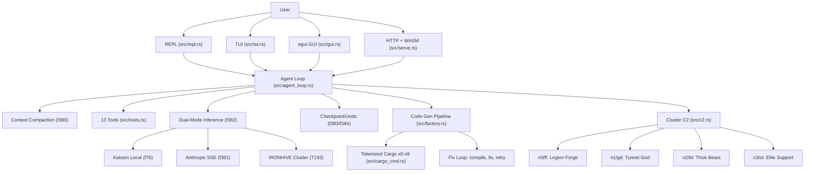

<!-- Unlicense — cochranblock.org -->

# Proof of Artifacts

*Concrete evidence that this project works, ships, and is real.*

> This is not a demo repo. This is a production augment engine. The artifacts below prove it.

## Architecture



## Build Output

| Metric | Value | Source |
|--------|-------|--------|
| Binary size (release) | 27 MB (opt-z, LTO, strip, codegen-units=1, panic=abort) | [`Cargo.toml`](Cargo.toml) profile |
| Android APK | 17 MB (signed release) | [Release v0.7.0](https://github.com/cochranblock/kova/releases/tag/v0.7.0) |
| Android AAB | 6.6 MB (signed, for Play Store) | [Release v0.7.0](https://github.com/cochranblock/kova/releases/tag/v0.7.0) |
| Lines of Rust | 41,629 across 103 files | `find src -name '*.rs' \| wc -l` |
| Tokenized functions | f0–f384 | [`docs/compression_map.md`](docs/compression_map.md) |
| Tokenized types | t0–T215 | [`docs/compression_map.md`](docs/compression_map.md) |
| Tokenization coverage | 100% | [`src/tokenization.rs`](src/tokenization.rs) |
| macOS x86_64 (Intel) | 13 MB (no RAG) | [Release v0.7.0](https://github.com/cochranblock/kova/releases/tag/v0.7.0) |
| User surfaces | 7 (REPL, TUI, GUI, HTTP+WASM, Android, iOS scaffold, PWA) | [`src/main.rs`](src/main.rs) |
| Agent tools | 13 | [`TOOLS` array in `src/tools.rs`](src/tools.rs) |
| Worker nodes | 4 (SSH orchestrated) | [`f350` in `src/c2.rs`](src/c2.rs) |
| Unit/integration tests | 314 passing | `cargo test --release -p kova` |
| LLMs evaluated | 42 (Micro Olympics) | [`docs/TOURNAMENT_RESULTS.md`](docs/TOURNAMENT_RESULTS.md) |

## QA Results (2026-04-02)

| Gate | Result | How to Verify |
|------|--------|--------------|
| cargo build --release | PASS | `cargo build --release -p kova --bin kova` |
| cargo clippy | PASS (zero warnings) | `cargo clippy --release -p kova --bin kova` |
| cargo test | PASS (314 tests) | `cargo test --release -p kova` |
| TRIPLE SIMS ([`exopack`](exopack/)) | 101 pass | `cargo run --features tests --bin kova-test` |

## Key Artifacts

| Artifact | Description | Source |
|----------|-------------|--------|
| Agent Loop | LLM calls 13 tools until task complete. Streams tokens. | [`f147`/`f148` in `src/agent_loop.rs`](src/agent_loop.rs) |
| Dual-Mode Inference | Local Kalosm GGUF or Anthropic SSE, auto-fallback | [`f382` in `src/inference/mod.rs`](src/inference/mod.rs) |
| Context Compaction | LLM-powered summarization at 80% context budget | [`f380` in `src/context_mgr.rs`](src/context_mgr.rs) |
| Checkpoint/Undo | Sled snapshots before every file write/edit | [`f383`/`f384` in `src/tools.rs`](src/tools.rs) |
| Permission Gates | Shell exec + git mutation gates in guarded mode | [`is_guarded`/`perm_gate` in `src/tools.rs`](src/tools.rs) |
| Code Gen Pipeline | Classify, generate, compile, review, fix loop, output | [`T181` in `src/factory.rs`](src/factory.rs) |
| MoE | Fan-out to N experts, compile all, score, pick winner | [`f341` in `src/moe.rs`](src/moe.rs) |
| Micro Olympics | 42 competitors, 6 events, 45 challenges | [`f250` in `src/micro/tournament.rs`](src/micro/tournament.rs) |
| C2 Swarm | Broadcast build, tmux dispatch, sponge mesh | [`f377`-`f379` in `src/c2.rs`](src/c2.rs) |
| WASM Client | Pure Rust egui compiled to WASM, embedded at build | [`src/web_client/`](src/web_client/) |
| RAG | fastembed vectors + sled index for codebase retrieval | [`src/rag.rs`](src/rag.rs) |
| Tokenization | 100% coverage — every public symbol compressed | [`src/tokenization.rs`](src/tokenization.rs) |

## Planned: Pyramid Architecture

> **Not yet implemented.** Design complete: [`docs/PYRAMID_ARCHITECTURE.md`](docs/PYRAMID_ARCHITECTURE.md)

- Subatomic models (sub-100K params) in shared mmap'd nanobyte blob
- 11-model starter pack ships embedded in binary
- Noodle the penguin — companion AI (inspired by [Claude Code](https://claude.com/claude-code)'s buddy system)
- Claude migration path: pyramid seals shut, zero external API dependency

## How to Verify

```bash
cargo build -p kova --release
ls -lh target/release/kova            # 27 MB
cargo test --release -p kova           # 314 tests pass
kova tokens                            # 100% tokenization coverage
kova --help                            # all subcommands
kova                                   # REPL with agent loop
kova c2 ncmd ci --oneline             # cluster status
kova micro tournament                  # run Micro Olympics
```

## Federal Compliance

| Document | Status |
|----------|--------|
| SBOM (EO 14028) | [`govdocs/SBOM.md`](govdocs/SBOM.md) |
| SSDF (NIST 800-218) | [`govdocs/SSDF.md`](govdocs/SSDF.md) |
| Supply Chain | [`govdocs/SUPPLY_CHAIN.md`](govdocs/SUPPLY_CHAIN.md) |
| Security | [`govdocs/SECURITY.md`](govdocs/SECURITY.md) |
| Section 508 | [`govdocs/ACCESSIBILITY.md`](govdocs/ACCESSIBILITY.md) |
| Privacy | [`govdocs/PRIVACY.md`](govdocs/PRIVACY.md) |
| FIPS | [`govdocs/FIPS.md`](govdocs/FIPS.md) |
| FedRAMP | [`govdocs/FedRAMP_NOTES.md`](govdocs/FedRAMP_NOTES.md) |
| CMMC | [`govdocs/CMMC.md`](govdocs/CMMC.md) |
| ITAR/EAR | [`govdocs/ITAR_EAR.md`](govdocs/ITAR_EAR.md) |

---

*Part of the [CochranBlock](https://cochranblock.org) zero-cloud architecture. All source under the Unlicense.*
