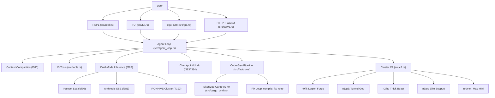

<!-- Unlicense — cochranblock.org -->

# Proof of Artifacts

*Concrete evidence that this project works, ships, and is real.*

> This is not a demo repo. This is a production augment engine. The artifacts below prove it.

## Architecture



## What It Is

Augment engine. Local-first agentic tool loop with dual-mode inference (local GGUF or Anthropic SSE), 5-node SSH swarm orchestration, and tokenized-everything compression. One <10 MB binary. No cloud.

## Build Output

| Metric | Value | Source |
|--------|-------|--------|
| Binary size (release) | 27 MB (opt-z, LTO, strip, codegen-units=1, panic=abort) | [`Cargo.toml`](Cargo.toml) profile |
| Android APK | 17 MB (signed release) | [Release v0.7.0](https://github.com/cochranblock/kova/releases/tag/v0.7.0) |
| Android AAB | 6.6 MB (signed, for Play Store) | [Release v0.7.0](https://github.com/cochranblock/kova/releases/tag/v0.7.0) |
| Lines of Rust | 41,629 across 103 files | `find src -name '*.rs' \| wc -l` |
| Tokenized functions | f0–f384 | [`docs/compression_map.md`](docs/compression_map.md) |
| Tokenized types | t0–T215 | [`docs/compression_map.md`](docs/compression_map.md) |
| Tokenization coverage | 100% | [`src/tokenization.rs`](src/tokenization.rs) |
| macOS x86_64 (Intel) | 13 MB (no RAG) | [Release v0.7.0](https://github.com/cochranblock/kova/releases/tag/v0.7.0) |
| User surfaces | 7 (REPL, TUI, GUI, HTTP+WASM, Android, iOS scaffold, PWA) | [`src/main.rs`](src/main.rs) |
| Agent tools | 13 | [`TOOLS` array in `src/tools.rs`](src/tools.rs) |
| Worker nodes | 5 (SSH orchestrated) | [`f350` in `src/c2.rs`](src/c2.rs) |
| Unit/integration tests | 314 passing | `cargo test --release -p kova` |
| LLMs evaluated | 42 (Micro Olympics) | [`docs/TOURNAMENT_RESULTS.md`](docs/TOURNAMENT_RESULTS.md) |

## QA Results (2026-04-02)

| Gate | Result | How to Verify |
|------|--------|--------------|
| cargo build --release | PASS | `cargo build --release -p kova --bin kova` |
| cargo clippy | PASS (zero warnings) | `cargo clippy --release -p kova --bin kova` |
| cargo test | PASS (314 tests) | `cargo test --release -p kova` |
| TRIPLE SIMS ([`exopack`](exopack/)) | 101 pass | `cargo run --features tests --bin kova-test` |

## Quick Start

```bash
# Build (release, with HTTP API)
cargo build --release -p kova-engine --features serve --bin kova

# Or install from crates.io
cargo install kova-engine --features serve

# Default UI: TUI (chat + Visual QC, Claude-Code-like)
kova

# HTTP API + web client at /
kova serve

# Zero-input baked demo: exercises every CLI subcommand + HTTP endpoint
kova demo                    # requires --features baked_demo

# Inspect the cluster: Host | Cores | RAM | Disk(GB free) | GPU
kova c2 inspect

# TRIPLE SIMS deploy gate: clippy, 3× cargo test, release build, smoke
kova test                    # requires --features tests
```

5 nodes today: `n0/lf` (Legion Forge), `n1/gd` (Tunnel God), `n2/bt` (Thick Beast), `n3/st` (Elite Support), `n4/mm` (Mac Mini / c2-core).

## Build

```sh
cargo build                          # default (serve + inference + rag + tui)
cargo build --release --features serve --target aarch64-apple-darwin
cargo run --features tests --bin kova-test   # quality gate
cargo test --release -p kova                 # 314 unit/integration tests
kova tokens                          # validate tokenization coverage
```

## What Works Today

### Agent Loop ([`src/agent_loop.rs`](src/agent_loop.rs))

Streaming agentic tool loop. LLM calls tools, gets results, repeats until done. Dual-mode inference via `KOVA_INFERENCE` env — local Kalosm GGUF or Anthropic API with SSE streaming ([`f382`](src/inference/mod.rs)). Context auto-compacts at 80% of budget via LLM-powered summarization ([`f380`](src/context_mgr.rs)). File checkpoints taken before every write/edit for undo support ([`f383`/`f384`](src/tools.rs)).

- [`f147`](src/agent_loop.rs) — single agent turn: inference, parse tool calls, execute, return action
- [`f148`](src/agent_loop.rs) — agent loop: run turns until done or max iterations

### Tools ([`src/tools.rs`](src/tools.rs), 2,017 lines)

13 tools available to the agent. Registered in [`TOOLS`](src/tools.rs) array, dispatched by [`f141`](src/tools.rs):

| Tool | Implementation | Purpose |
|------|---------------|---------|
| `read_file` | [`f142`](src/tools.rs) | Read file contents with optional offset/limit |
| `write_file` | [`f143`](src/tools.rs) | Write content to file, auto-creates dirs |
| `edit_file` | [`f144`](src/tools.rs) | Find-and-replace exact text (must be unique match) |
| `exec` | [`f145`](src/tools.rs) | Shell command execution via `$SHELL` (default `/bin/sh`) |
| `glob` | [`f146`](src/tools.rs) | Find files matching glob patterns |
| `grep` | [`f150`](src/tools.rs) | Search file contents for text patterns |
| `memory_write` | [`f155`](src/tools.rs) | Append to persistent memory (`~/.kova/memory.md`) |
| `code_review` | [`f207`](src/tools.rs) | LLM-powered code review with severity scoring |
| `code_outline` | [`f208`](src/tools.rs) | Extract functions, structs, enums from Rust source |
| `record_failure` | [`f209`](src/tools.rs) | Record challenge failure for training feedback loop |
| `undo_edit` | [`f384`](src/tools.rs) | Restore file from last checkpoint (sled-backed) |
| `rag_search` | [`f166`](src/rag.rs) | Semantic search over indexed codebase (requires `rag` feature) |
| `pixel_forge` | [`f220`](src/tools.rs) | Generate pixel art sprites via Pixel Forge plugin |

Permission gates ([`is_guarded`/`perm_gate`](src/tools.rs)): `KOVA_PERMS=guarded` prompts before shell execution and git mutations ([`is_git_mutation`](src/tools.rs)). Default is `open` (no prompts).

### REPL ([`src/repl.rs`](src/repl.rs))

Interactive chat. `kova` with no args starts the REPL ([`f137`](src/repl.rs)). System prompt assembled by [`f139`](src/repl.rs) from persona, project context, memory, and tool definitions. Routes through [`f382`](src/inference/mod.rs) (local/remote/auto inference). Commands: `/exit`, `/clear`, `/project <path>`, `/tools`.

### C2 Swarm Orchestration ([`src/c2.rs`](src/c2.rs), 1,309 lines)

Distributed build and command execution across 5 worker nodes ([`f350`](src/c2.rs)):

- **Broadcast build** ([`f356`](src/c2.rs)): One-command sync + `cargo build --release` on all nodes
- **Parallel sync** ([`f357`](src/c2.rs)): Tar-stream or rsync to all nodes
- **tmux dispatch** ([`f377`](src/c2.rs)): Send to tmux pane with retry + exponential backoff
- **tmux broadcast** ([`f378`](src/c2.rs)): Send to all windows with stagger delay
- **sponge mesh** ([`f379`](src/c2.rs)): Fast pass + rate-limit-aware retry with backoff
- **Node commands** ([`src/node_cmd.rs`](src/node_cmd.rs)): Tokenized SSH commands `c1-c9`, `ci` (status, specs, services, sync, build, deploy)
- **Wake-on-LAN** ([`f352`](src/c2.rs)): Wake sleeping nodes via MAC address
- **SSH host certificates** ([`src/ssh_ca.rs`](src/ssh_ca.rs)): Zero-churn host key management
- **Binary deploy** ([`f370`](src/c2.rs)): rsync kova + models to nodes, restart services
- **Hardware inspection** ([`src/inspect.rs`](src/inspect.rs)): CPU, RAM, GPU, disk detection via SSH ([`f359`](src/inspect.rs))

### Inference ([`src/inference/`](src/inference/))

Three backends, one dispatcher:

| Backend | Module | Key Function | Method |
|---------|--------|-------------|--------|
| Local GGUF | [`inference/local.rs`](src/inference/local.rs) | [`f76`](src/inference/local.rs) | Kalosm + candle, LRU model cache, streaming |
| Anthropic API | [`inference/providers.rs`](src/inference/providers.rs) | [`f381`](src/inference/providers.rs) | SSE streaming, `content_block_delta` parsing |
| IRONHIVE cluster | [`inference/cluster.rs`](src/inference/cluster.rs) | [`T193.dispatch`](src/inference/cluster.rs) | Distributed dispatch across worker nodes |
| Multi-provider | [`inference/providers.rs`](src/inference/providers.rs) | [`f199`](src/inference/providers.rs) | Ollama, OpenAI-compat, Anthropic (non-streaming) |

[`f382`](src/inference/mod.rs) (dual_stream) reads `KOVA_INFERENCE` env: `local`, `remote`, or `auto` (default — local if model exists, else Anthropic API). `KOVA_MODEL` overrides the remote model.

### Context Management ([`src/context_mgr.rs`](src/context_mgr.rs), 549 lines)

- **Token estimation** ([`f170`](src/context_mgr.rs)): chars/4 rough count
- **Context compaction** ([`f380`](src/context_mgr.rs)): When conversation hits 80% of budget, older turns are sent to inference for LLM-powered summarization. Recent 4 turns kept intact. Falls back to static trim ([`f171`](src/context_mgr.rs)) if needed.
- **Tool output trimming** ([`f172`](src/context_mgr.rs)): Head/tail with `[truncated]` marker
- **File checkpointing** ([`f383`](src/tools.rs)/[`f384`](src/tools.rs)): Snapshots file contents to sled before write/edit. `undo_edit` tool restores from last checkpoint.

### Micro Olympics ([`src/micro/`](src/micro/))

Local LLM tournament system. Models compete across weight classes and event types.

- **Tournament** ([`src/micro/tournament.rs`](src/micro/tournament.rs)): 6 event types (sprint, technical, freestyle, judged, endurance, anti-slop), weight class brackets, DQ mechanism ([`f250`](src/micro/tournament.rs))
- **Training** ([`src/micro/candle_train.rs`](src/micro/candle_train.rs)): Pure Rust transformer training via candle. Three tiers — Spark 50K, Flame 500K, Blaze 2M ([`KovaClassifier`](src/micro/kova_model.rs))
- **Quantization** ([`src/micro/quantize.rs`](src/micro/quantize.rs)): TurboQuant — FWHT ([`f366`](src/micro/quantize.rs)) + mixed-precision 2/4-bit ([`f371`](src/micro/quantize.rs)) + QJL residual recovery
- **Routing** ([`src/micro/router.rs`](src/micro/router.rs)): Epsilon-greedy bandit for template selection ([`T153`](src/micro/router.rs))
- **Validation** ([`src/micro/validate.rs`](src/micro/validate.rs)): Completeness, coherence, format, confidence checks ([`f263`](src/micro/validate.rs))
- **Pipeline** ([`src/micro/pipe.rs`](src/micro/pipe.rs)): Classify -> route -> run -> validate ([`f240`](src/micro/pipe.rs))
- **Training data** ([`src/micro/train.rs`](src/micro/train.rs)): Tournament results -> DPO pairs ([`f255`](src/micro/train.rs)) and SFT examples ([`f256`](src/micro/train.rs))

### Code Generation Pipeline

- **Factory** ([`src/factory.rs`](src/factory.rs)): 6-stage pipeline — classify, generate, compile, review, fix loop, output ([`T181`](src/factory.rs))
- **MoE** ([`src/moe.rs`](src/moe.rs)): Fan-out to N expert nodes, compile all variants, score, pick winner ([`f341`](src/moe.rs))
- **Academy** ([`src/academy.rs`](src/academy.rs)): Autonomous dev agent — task breakdown, code gen, test, commit ([`f301`](src/academy.rs))
- **Gauntlet** ([`src/gauntlet.rs`](src/gauntlet.rs)): 5-phase stress test — crawl, walk, run, fight, survive ([`T187`](src/gauntlet.rs))

### Surfaces

| Surface | Module | Status |
|---------|--------|--------|
| TUI | [`src/tui.rs`](src/tui.rs) (1,672 lines) | Ratatui terminal UI — agent chat, visual QC |
| Native GUI | [`src/gui.rs`](src/gui.rs) (1,660 lines) | egui desktop — REPL, backlog, sprite QC |
| HTTP API | [`src/serve.rs`](src/serve.rs) (1,351 lines) | Axum + WebSocket streaming + embedded WASM client |
| MCP Server | [`src/mcp.rs`](src/mcp.rs) (508 lines) | Model Context Protocol via JSON-RPC stdio |
| WASM Client | [`src/web_client/`](src/web_client/) | egui in browser via `kova s` |

### Other Working Modules

| Module | Lines | Purpose |
|--------|-------|---------|
| [`config.rs`](src/config.rs) | 791 | Config, paths, feature detection, model resolution |
| [`rag.rs`](src/rag.rs) | 749 | fastembed vectors, sled index, chunk + search Rust files |
| [`feedback.rs`](src/feedback.rs) | 702 | Failure recording ([`f194`](src/feedback.rs)), harder challenge generation ([`f196`](src/feedback.rs)), DPO loop |
| [`syntax.rs`](src/syntax.rs) | 636 | Symbol extraction from Rust source files |
| [`review.rs`](src/review.rs) | 477 | LLM code review: staged ([`f186`](src/review.rs)), branch diff ([`f187`](src/review.rs)), severity scoring |
| [`git_cmd.rs`](src/git_cmd.rs) | 450 | Tokenized git commands g0-g9 ([`f156`-`f160`](src/git_cmd.rs)), compressed output |
| [`ci.rs`](src/ci.rs) | 387 | CI mode: headless quality gate ([`f177`](src/ci.rs)), watch for changes ([`f178`](src/ci.rs)) |
| [`imagegen.rs`](src/imagegen.rs) | 383 | Image generation: Stable Diffusion ([`f190`](src/imagegen.rs)), DALL-E dispatch ([`f191`](src/imagegen.rs)) |
| [`training_data.rs`](src/training_data.rs) | 375 | Trace -> DPO/SFT/CSV export ([`f181`](src/training_data.rs)) for fine-tuning |
| [`trace.rs`](src/trace.rs) | — | LLM call logging ([`T109`](src/trace.rs), [`f161`](src/trace.rs)) |
| [`tokenization.rs`](src/tokenization.rs) | 308 | Compression protocol validator |
| [`cargo_cmd.rs`](src/cargo_cmd.rs) | 887 | Tokenized cargo wrapper x0-x9 ([`f133`-`f136`](src/cargo_cmd.rs)) |
| [`storage.rs`](src/storage.rs) | 123 | Sled-backed key-value storage ([`t12`](src/storage.rs)) |

## Key Artifacts

| Artifact | Description | Source |
|----------|-------------|--------|
| Agent Loop | LLM calls 13 tools until task complete. Streams tokens. | [`f147`/`f148` in `src/agent_loop.rs`](src/agent_loop.rs) |
| Dual-Mode Inference | Local Kalosm GGUF or Anthropic SSE, auto-fallback | [`f382` in `src/inference/mod.rs`](src/inference/mod.rs) |
| Context Compaction | LLM-powered summarization at 80% context budget | [`f380` in `src/context_mgr.rs`](src/context_mgr.rs) |
| Checkpoint/Undo | Sled snapshots before every file write/edit | [`f383`/`f384` in `src/tools.rs`](src/tools.rs) |
| Permission Gates | Shell exec + git mutation gates in guarded mode | [`is_guarded`/`perm_gate` in `src/tools.rs`](src/tools.rs) |
| Code Gen Pipeline | Classify, generate, compile, review, fix loop, output | [`T181` in `src/factory.rs`](src/factory.rs) |
| MoE | Fan-out to N experts, compile all, score, pick winner | [`f341` in `src/moe.rs`](src/moe.rs) |
| Micro Olympics | 42 competitors, 6 events, 45 challenges | [`f250` in `src/micro/tournament.rs`](src/micro/tournament.rs) |
| C2 Swarm | Broadcast build, tmux dispatch, sponge mesh | [`f377`-`f379` in `src/c2.rs`](src/c2.rs) |
| WASM Client | Pure Rust egui compiled to WASM, embedded at build | [`src/web_client/`](src/web_client/) |
| RAG | fastembed vectors + sled index for codebase retrieval | [`src/rag.rs`](src/rag.rs) |
| Tokenization | 100% coverage — every public symbol compressed | [`src/tokenization.rs`](src/tokenization.rs) |
| Swarm Training | Trigram hash → linear classifier, GPU-accelerated | [`f389`-`f392` in `src/swarm/train.rs`](src/swarm/train.rs) |
| C2 Fleet | Status, peek, unblock daemon, QA sweep | [`f385`-`f388` in `src/c2.rs`](src/c2.rs) |
| NanoSign | Universal AI model signing (36 bytes, BLAKE3) | [`docs/NANOSIGN.md`](docs/NANOSIGN.md) |
| Nanobyte Format | Packed model file: 64B header + manifest + f32 weights + NSIG trailer; mmap-loadable | [`src/nanobyte.rs`](src/nanobyte.rs) |
| Intent Classifier | banking77 trigram-hash linear, 315K params, 80.36% test accuracy | [`assets/models/intent_classifier/`](assets/models/intent_classifier/) |
| bench-classify | Held-out test harness: accuracy, macro-F1, lowest-F1 classes, top confusions | [`src/bin/bench-classify.rs`](src/bin/bench-classify.rs) |
| Nanobyte Inference | `nb.infer(model, text) → (idx, conf)` mirrors swarm predict path; parity-tested vs on-disk swarm | [`Nanobyte::infer` in `src/nanobyte.rs`](src/nanobyte.rs) |
| Embedded Starter | 9,592-byte `STARTER_NANOBYTE` baked via `include_bytes!`; zero file I/O at startup | [`STARTER_NANOBYTE` in `src/nanobyte.rs`](src/nanobyte.rs) |
| REPL Subatomic Telemetry | T1 classifiers run on every input + response; persisted to sled `tele/{ts}/{i\|o}` | [`src/repl.rs`](src/repl.rs) |

## Proven: Subatomic Models on AMD GPU

3 models trained on bt's RX 5700 XT via [any-gpu](https://github.com/cochranblock/any-gpu) Vulkan. Weights in [`assets/models/`](assets/models/).

Original training (256-dim hash):

| Model | Params | Accuracy | Train Time | Inference | Source |
|-------|--------|----------|-----------|-----------|--------|
| slop_detector | 514 | 89.4% | 18.4s | ~5us | [`assets/models/slop_detector/`](assets/models/slop_detector/) |
| code_vs_english | 514 | 94.2% | 4.2s | ~4us | [`assets/models/code_vs_english/`](assets/models/code_vs_english/) |
| lang_detector | 1,285 | 97.0% | 12.9s | ~6us | [`assets/models/lang_detector/`](assets/models/lang_detector/) |

Retrained 2026-05-07 at 8192-dim hash (gap 12.1, [`src/bin/retrain-starters.rs`](src/bin/retrain-starters.rs)). Mixed result — see TOI for analysis:

| Model | Params (new) | Train Acc (new) | Δ |
|-------|--------------|-----------------|---|
| slop_detector | 16,386 | 88.5% | -0.9 |
| code_vs_english | 16,386 | **97.1%** | **+2.9** |
| lang_detector | 40,965 | 93.3% | -3.7 (overparameterized — only 105 train examples) |

Training corpus: 240,596 crates from crates.io (34GB) on bt `/mnt/data/crates/`. Extraction: [`scripts/extract_corpus.sh`](scripts/extract_corpus.sh). Training data: [`scripts/build_training_data.sh`](scripts/build_training_data.sh).

A 4th starter — `intent_classifier` (banking77, 77 classes, 4096 hash dim, 315,469 params) — was added 2026-05-06. CPU-trained on bt (no GPU); see [`assets/models/intent_classifier/`](assets/models/intent_classifier/). **Held-out test accuracy: 80.36%** on the banking77 test split (3,080 examples; macro F1 81.10%) per [`src/bin/bench-classify.rs`](src/bin/bench-classify.rs).

Packed into [`assets/starter.nanobyte`](assets/starter.nanobyte) (1,557,244 bytes — 64B header + 320B manifest + ~1.55MB weights + 36B NSIG, BLAKE3-verified) via [`src/bin/pack-starter.rs`](src/bin/pack-starter.rs). 389,206 total params across 4 models (3 starters at 8192-dim hash + intent_classifier at 4096-dim).

## Planned: Pyramid Architecture

> Blueprint: [`docs/KOVA_BLUEPRINT.md`](docs/KOVA_BLUEPRINT.md). Model catalog: [`docs/SUBATOMIC_CATALOG.md`](docs/SUBATOMIC_CATALOG.md).

Replace external AI APIs with a pyramid of locally-trained models. Not competing on model size — competing on SPEED and SPECIALIZATION.

- **Tier 1 — Subatomic** (sub-100K params): 66 unique single-task classifiers + 6 shared universals. ~55K total params. Fits in L2 cache. Microsecond inference. Full catalog: [`docs/SUBATOMIC_CATALOG.md`](docs/SUBATOMIC_CATALOG.md). First proof-of-concept: **Noodle the penguin** — companion AI inspired by [Claude Code](https://claude.com/claude-code)'s buddy system.
- **Tier 2 — Molecular** (100K-1M params): Coordinators with learned routing weights to subatomics. Intent routing, context summarization, tool selection.
- **Tier 3 — Cellular** (1M-10M params): Domain specialists. Code generation, conversation, planning.
- **Starter Nanobyte**: 11 subatomic models ship embedded in the binary — working pyramid on first run, zero setup (~370K params, <2MB quantized).

All tiers share a single mmap'd weight blob called a **nanobyte**. Each model is a Rust function reading from different byte offsets. Cross-tier routing weights are trained, not hardcoded. Confidence gating — most requests never get past T1.

### Key Concepts

- **Sled priority queue** — one sled DB, priority scores per model, OS page cache handles memory hierarchy. No manual zones. ([blueprint](docs/KOVA_BLUEPRINT.md#3-memory-architecture-one-sled-one-priority-queue))
- **Intent-driven priority** — human input drives which models are hot. The human is the cache controller. ([blueprint](docs/KOVA_BLUEPRINT.md#4-intent-driven-priority-engine))
- **Shared models** — 6 universal models (visibility, doc-needed, lifetime-needed, naming, complexity, deprecated) work across all Rust constructs. ([catalog](docs/SUBATOMIC_CATALOG.md#shared-models-across-constructs))
- **NanoSign** — universal AI model signing. 36 bytes (NSIG + BLAKE3 hash) appended to any model file. Self-verifying. Format-agnostic. ([spec](docs/NANOSIGN.md))
- **P23 Triple Lens** — all architecture decisions use 3 opposing perspectives (optimist/pessimist/paranoia) + synthesis. ([blueprint](docs/KOVA_BLUEPRINT.md#10-p23-triple-lens-research-protocol))

### Claude Migration

Claude trains its own replacement at every level via PTY bridge logging. Phase 1: subatomics online. Phase 2: molecular replaces Claude T2. Phase 3: cellular replaces T3. **Phase 4: pyramid seals shut, API key deleted, zero dependency.** ([blueprint](docs/KOVA_BLUEPRINT.md#8-claude-migration-path))

**What exists:** swarm training infra ([`src/swarm/`](src/swarm/)), 3 proven models ([`assets/models/`](assets/models/)), 240K crate corpus, candle training ([`src/micro/candle_train.rs`](src/micro/candle_train.rs)), tournament scoring, quantization, routing, validation. **What's not built yet:** nanobyte format, pyramid orchestrator, PTY bridge, discovery module.

## Crate Structure

```
kova/             — single crate, 103 Rust source files, ~41,600 lines
  src/            — all source
  src/web_client/ — WASM thin client (cross-compiled via wasm/)
exopack/          — test augmentation library (separate crate)
wasm/             — WASM build manifest
```

## Tokenization ([`src/tokenization.rs`](src/tokenization.rs))

100% compression protocol coverage. Every public function and type is tokenized.

```
$ kova tokens
tokenization: 100.0% (368/368)
  fn: 231/231 tokenized (highest: f384)
  ty: 137/137 tokenized (highest: T215)
```

Canonical map: [`docs/compression_map.md`](docs/compression_map.md)

## Worker Nodes ([`f350`](src/c2.rs))

| Token | Host | Role |
|-------|------|------|
| n0/lf | kova-legion-forge | Primary build |
| n1/gd | kova-tunnel-god | Tunnel/relay |
| n2/bt | kova-thick-beast | Heavy compute |
| n3/st | kova-elite-support | Support/backup |

## Supported Platforms

| Platform | Binary | Size | Status |
|----------|--------|------|--------|
| macOS ARM64 (M1/M2/M3/M4) | `kova-macos-arm64` | 27 MB | Full (all features) |
| macOS x86_64 (Intel) | `kova-macos-x86_64` | 13 MB | No RAG (ort lacks x86 prebuilts) |
| Android arm64-v8a | `kova-android.apk` / `.aab` | 17 MB / 6.6 MB | GUI + mobile-llm |
| Linux x86_64 (Debian) | Build on node | ~25 MB | Full (build on st/gd) |
| iOS arm64 | `libkova_ios.a` | scaffold | staticlib, needs Xcode |
| Web (PWA) | WASM + service worker | ~2.5 MB | Offline-first, installable |
| Snap (Linux) | `snap/snapcraft.yaml` | — | core22, classic confinement |

## Binaries ([`Cargo.toml`](Cargo.toml))

| Binary | Features | Purpose |
|--------|----------|---------|
| `kova` | serve, inference, rag, tui | All-inclusive: TUI, GUI, HTTP, LLM, swarm, tools |
| `kova-test` | tests ([`exopack`](exopack/)) | Quality gate: clippy, TRIPLE SIMS 3x, release build ([`f315`](src/lib.rs)) |

## Features ([`Cargo.toml`](Cargo.toml))

```toml
default    = ["serve", "inference", "rag", "tui"]
serve      = axum + tower + tracing (+ WASM thin client)
gui        = eframe + egui (native desktop)
tui        = ratatui + crossterm (terminal UI)
inference  = kalosm + reqwest + lru
mobile-llm = candle-core + candle-nn (on-device training/inference)
autopilot  = enigo (type into Cursor)
daemon     = capnp (worker node)
tests      = exopack (quality gate)
rag        = fastembed + ordered-float
```

## Environment Variables

| Variable | Values | Where It's Read | Purpose |
|----------|--------|----------------|---------|
| `KOVA_INFERENCE` | `local`, `remote`, `auto` | [`f382`](src/inference/mod.rs) | Inference backend selection (default: auto) |
| `KOVA_MODEL` | model name | [`remote_stream`](src/inference/mod.rs) | Override remote model (default: claude-sonnet-4-6) |
| `KOVA_PERMS` | `open`, `guarded` | [`is_guarded`](src/tools.rs) | Permission mode (default: open) |
| `ANTHROPIC_API_KEY` | API key | [`remote_stream`](src/inference/mod.rs) | Required for remote inference |

## Tests

314 tests passing. Run with `cargo test --release -p kova`.

Coverage includes: tool dispatch ([`f141`](src/tools.rs)), context compaction thresholds ([`context_mgr::tests`](src/context_mgr.rs)), checkpoint/undo roundtrips ([`f383`/`f384` tests](src/tools.rs)), permission gate logic ([`is_guarded` tests](src/tools.rs)), git mutation detection ([`is_git_mutation` tests](src/tools.rs)), tool parsing ([`f140` tests](src/tools.rs)), code outline, file operations, CI pipeline ([`ci::tests`](src/ci.rs)), integration tests ([`tests/integration.rs`](tests/integration.rs)).

## How to Verify

```bash
cargo build -p kova --release
ls -lh target/release/kova            # 27 MB
cargo test --release -p kova           # 314 tests pass
kova tokens                            # 100% tokenization coverage
kova --help                            # all subcommands
kova                                   # REPL with agent loop
kova c2 ncmd ci --oneline             # cluster status
kova micro tournament                  # run Micro Olympics
```

## Federal Compliance

| Document | Status |
|----------|--------|
| SBOM (EO 14028) | [`govdocs/SBOM.md`](govdocs/SBOM.md) |
| SSDF (NIST 800-218) | [`govdocs/SSDF.md`](govdocs/SSDF.md) |
| Supply Chain | [`govdocs/SUPPLY_CHAIN.md`](govdocs/SUPPLY_CHAIN.md) |
| Security | [`govdocs/SECURITY.md`](govdocs/SECURITY.md) |
| Section 508 | [`govdocs/ACCESSIBILITY.md`](govdocs/ACCESSIBILITY.md) |
| Privacy | [`govdocs/PRIVACY.md`](govdocs/PRIVACY.md) |
| FIPS | [`govdocs/FIPS.md`](govdocs/FIPS.md) |
| FedRAMP | [`govdocs/FedRAMP_NOTES.md`](govdocs/FedRAMP_NOTES.md) |
| CMMC | [`govdocs/CMMC.md`](govdocs/CMMC.md) |
| ITAR/EAR | [`govdocs/ITAR_EAR.md`](govdocs/ITAR_EAR.md) |

## Why This Exists — CochranBlock

> **It's not the Mech — it's the pilot.**
>
> This repo is part of [CochranBlock](https://cochranblock.org) — 8 Unlicense Rust repositories that power an entire company on a **single <10 MB binary**, a laptop, and a **$10/month** Cloudflare tunnel. No AWS. No Kubernetes. No six-figure DevOps team. Zero cloud.
>
> **[cochranblock.org](https://cochranblock.org)** is a live demo of this architecture. Every line of source code is public domain.
>
> Every repo ships with **[Proof of Artifacts](PROOF_OF_ARTIFACTS.md)** (wire diagrams, screenshots, and build output proving the work is real) and a **[Timeline of Invention](TIMELINE_OF_INVENTION.md)** (dated commit-level record proving human-piloted AI development, not generated spaghetti).
>
> **Looking to cut your server bill by 90%?** → [Zero-Cloud Tech Intake Form](https://cochranblock.org/deploy)

---

*Part of the [CochranBlock](https://cochranblock.org) zero-cloud architecture. All source under the Unlicense.*
