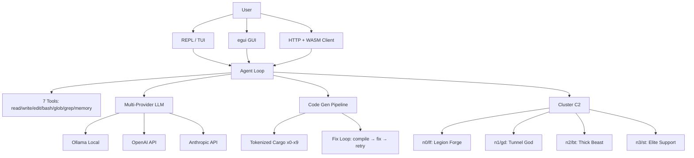

<!-- Unlicense — cochranblock.org -->

# Proof of Artifacts

*Concrete evidence that this project works, ships, and is real.*

> This is not a demo repo. This is a production augment engine. The artifacts below prove it.

## Architecture



## Build Output

| Metric | Value |
|--------|-------|
| Binary size | 55 MB (release, stripped, LTO) |
| Lines of Rust | 63,353 across 101 files |
| Tokenized functions | 231 (f0–f365) |
| Tokenized types | 137 (t0–t213) |
| Tokenization coverage | 100% (368/368 symbols) |
| User surfaces | 4 (REPL, TUI, GUI, HTTP+WASM) |
| CLI subcommands | 20+ with tokenized short forms |
| Worker nodes | 4 (SSH orchestrated) |
| LLMs evaluated | 42 (Micro Olympics tournament) |

## Key Artifacts

| Artifact | Description |
|----------|-------------|
| Agent Loop | LLM calls tools until task complete — read, write, edit, bash, glob, grep, memory |
| Code Gen Pipeline | Intent → generate → cargo check → fix loop (2 retries) → clippy → test |
| Micro Olympics | 42 competitors, 6 events, 45 challenges. Champion: qwen2.5-coder:0.5b (91% accuracy) |
| C2 Swarm | Tar-stream sync (one disk read, N network writes), broadcast builds, job queue with circuit breaker |
| WASM Client | Pure Rust egui compiled to WASM — no JavaScript. Embedded at build time |
| Tokenization | Every public symbol compressed (f/t/s tokens) for LLM context efficiency |
| RAG | fastembed vectors + sled index for codebase retrieval |
| MoE Routing | Fan-out to multiple models, score, pick best response |

## How to Verify

```bash
cargo build -p kova --release
ls -lh target/release/kova            # 55 MB
kova tokens                            # 100% tokenization coverage
kova chat                              # Agent loop with tool use
kova c2 ncmd ci --oneline             # Cluster status
```

---

*Part of the [CochranBlock](https://cochranblock.org) zero-cloud architecture. All source under the Unlicense.*
