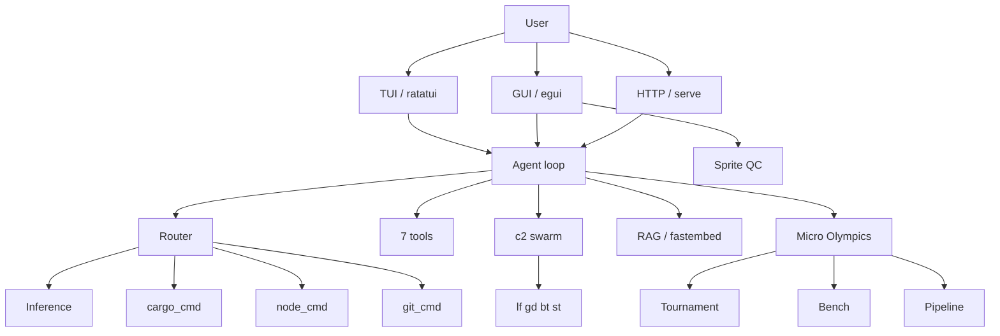
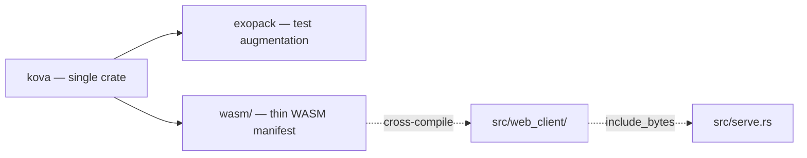

<!-- Unlicense — cochranblock.org -->
<!-- Contributors: Mattbusel (XFactor), GotEmCoach, KOVA, Claude Opus 4.6, SuperNinja, Composer 1.5, Google Gemini Pro 3 -->

<p align="center">
  
</p>

# Kova

Augment engine. Local LLM agentic tool loop, swarm orchestration, tokenized everything.

## Proof of Artifacts

*Wire diagrams and GUI screenshots for quick review.*

### Wire / Architecture



### Crate Structure



One crate. Source in `src/`. WASM thin client source lives in `src/web_client/`, cross-compiled via `wasm/Cargo.toml`. exopack is the only separate crate (testing).

### GUI Screenshots

| Surface | Screenshot | Description |
|---------|-----------|-------------|
| TUI |  | Ratatui terminal UI — agent loop, chat, visual QC |
| Native GUI |  | egui desktop — REPL, backlog, sprite QC |
| Web Client |  | WASM thin client — egui in browser via `kova s` |
| Token Validator |  | `kova tokens` — 100% compression coverage |

> Screenshots captured via `./scripts/capture-screenshots.sh`. If images are missing, run the script or build kova with `--features serve,gui`.

---

## Tokenization

100% compression protocol coverage. Every public function and type is tokenized.

```
$ kova tokens
tokenization: 100.0% (368/368)
  fn: 231/231 tokenized (highest: f365)
  ty: 137/137 tokenized (highest: T213)
```

Canonical map: [`docs/compression_map.md`](docs/compression_map.md)

---

## Artifacts

| Artifact | What | Lines |
|----------|------|-------|
| `src/main.rs` | CLI entrypoint. 15+ subcommands incl. tokenized `s`/`g` short forms | 1,778 |
| `src/tui.rs` | Ratatui TUI — agent chat, visual QC, swipe mode | 1,672 |
| `src/tools.rs` | 7 tools: read, write, edit, bash, glob, grep, memory_write | 1,412 |
| `src/serve.rs` | Axum HTTP API + WebSocket streaming + embedded WASM client | 1,240 |
| `src/academy.rs` | Recursive academy: training, evaluation, tournament wiring | 1,022 |
| `src/gui.rs` | Native egui desktop GUI + Sprite QC integration | 912 |
| `src/micro/tournament.rs` | Local LLM tournament. 42 competitors, 6 events, 45 challenges | 909 |
| `src/node_cmd.rs` | Tokenized SSH node commands (c1-c9, ci). Parallel execution | 879 |
| `src/inference/providers.rs` | Multi-provider inference: Ollama, OpenAI, Anthropic | 808 |
| `src/cargo_cmd.rs` | Tokenized cargo wrapper (x0-x9). Compressed output for AI context | 786 |
| `src/c2.rs` | Swarm orchestration: sync, build, broadcast to 4 worker nodes | 753 |
| `src/rag.rs` | RAG: fastembed vectors, sled index, chunk + search Rust files | 750 |
| `src/feedback.rs` | Failure analysis, challenge generation, DPO training loop | 703 |
| `src/config.rs` | Config, paths, feature detection, model resolution | 697 |
| `src/factory.rs` | Full pipeline: classify, generate, compile, review, fix loop | 667 |
| `src/syntax.rs` | Syntax-aware code analysis. Symbol extraction from Rust source | 637 |
| `src/moe.rs` | Mixture of Experts: fan-out to N nodes, compile, score, pick | 553 |
| `src/gauntlet.rs` | Hell Week stress test. 5 phases, no mercy | 539 |
| `src/web_client/app.rs` | WASM thin client. egui in browser, API + WebSocket | 530 |
| `src/mcp.rs` | MCP server (Model Context Protocol). JSON-RPC stdio transport | 509 |
| `src/review.rs` | LLM code review: staged, branch diff, severity scoring | 478 |
| `src/git_cmd.rs` | Tokenized git commands (g0-g9). Compressed output | 448 |
| `src/inference/cluster.rs` | IRONHIVE cluster: distributed AI across worker nodes | 424 |
| `src/tokenization.rs` | Compression protocol validator. `kova tokens` CLI | 305 |
| `src/ci.rs` | CI mode: headless quality gate, watch for changes | 387 |
| `src/imagegen.rs` | Image generation: Stable Diffusion, DALL-E dispatch | 384 |
| `.kova-aliases` | 110+ shell aliases for macOS + Debian. Deployed to all nodes | 280 |
| **Total** | **92 Rust source files** | **32,305** |

## Binaries

| Binary | Features | Purpose |
|--------|----------|---------|
| `kova` | serve, inference, rag, tui | All-inclusive: TUI, GUI, HTTP, LLM, swarm, tools |
| `kova-test` | tests (exopack) | Quality gate: clippy, TRIPLE SIMS 3x, release build, smoke |

## Tokenized Command Map

### Shell Aliases (`.kova-aliases`)

```
k     = kova              ks    = serve + open browser
kc    = chat (REPL)       kg    = gui
kt    = test              kb    = bootstrap
ktk   = tokens            kci   = ci mode
krv   = review            kfb   = feedback
kex   = export            kmcp  = mcp server
ktr   = traces            kf    = factory
kga   = gauntlet          kmoe  = moe
kcl   = cluster           krag  = rag
kx0-9 = cargo tokens      kn1-9 = node tokens
kc2b  = broadcast build   kc2s  = sync all
p0-p9 = cd to project     p0b   = cd + build
p0te  = kova test binary
```

### Cargo Tokens (`kova x`)

| Token | Command | Token | Command |
|-------|---------|-------|---------|
| x0 | build | x5 | build --release |
| x1 | check | x6 | clean |
| x2 | test | x7 | doc |
| x3 | clippy | x8 | fmt --check |
| x4 | run | x9 | bench |

### Node Tokens (`kova c2 ncmd`)

| Token | Command | Token | Command |
|-------|---------|-------|---------|
| c1 | nstat (status) | c6 | nbuild |
| c2 | nspec (specs) | c7 | nlog |
| c3 | nsvc (services) | c8 | nkill |
| c4 | nrust (rustup) | c9 | ndeploy |
| c5 | nsync | ci | compact inspect |

### Project Tokens

| Token | Project | Token | Project |
|-------|---------|-------|---------|
| p0 | kova | p5 | ronin-sites |
| p1 | approuter | p7 | exopack |
| p2 | cochranblock | p8 | whyyoulying |
| p3 | oakilydokily | p9 | wowasticker |
| p4 | rogue-repo | | |

## Micro Olympics

Local LLM tournament across the cluster. 42 competitors, 6 events, 45 challenges.

**Champion: qwen2.5-coder:0.5b** (500M params, 91% accuracy, 6/7 gold medals)

Full results: [`docs/TOURNAMENT_RESULTS.md`](docs/TOURNAMENT_RESULTS.md)

Run: `kova micro tournament`

## Worker Nodes

| Token | Host | Role |
|-------|------|------|
| n0/lf | kova-legion-forge | Primary build |
| n1/gd | kova-tunnel-god | Tunnel/relay |
| n2/bt | kova-thick-beast | Heavy compute |
| n3/st | kova-elite-support | Support/backup |

## Features

```toml
default  = ["serve", "inference", "rag", "tui"]
serve    = axum + tower + tracing (+ WASM thin client, built automatically)
gui      = eframe + egui (native desktop)
tui      = ratatui + crossterm (terminal UI)
inference = kalosm + reqwest + lru
autopilot = enigo (type into Cursor)
daemon   = capnp (worker node)
tests    = exopack (quality gate)
rag      = fastembed + ordered-float
```

## Build

```sh
cargo build                          # default (serve + inference + rag + tui)
cargo build --release --features serve --target aarch64-apple-darwin
cargo run --features tests --bin kova-test   # quality gate
kova tokens                          # validate tokenization coverage
```

**Serve (web GUI):** Builds WASM thin client automatically. Requires:
`rustup target add wasm32-unknown-unknown` and `cargo install wasm-bindgen-cli`.

## Setup

```sh
# Install aliases (macOS)
echo '[ -f "$HOME/.kova-aliases" ] && . "$HOME/.kova-aliases"' >> ~/.zshrc

# Deploy to worker nodes
kad   # or: for n in lf gd bt st; do scp .kova-aliases "$n":~/; done

# Bootstrap kova config
kova bootstrap

# Install local LLM
kova model install
```

---

Unlicense — cochranblock.org