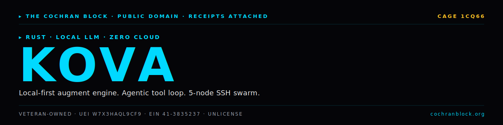

<!-- COCHRANBLOCK-BRAND-HEADER:START - generated by cochranblock/scripts/brand-stamp.sh -->
<picture>
  <source media="(prefers-color-scheme: dark)" srcset="assets/brand/banner.svg">
  <source media="(prefers-color-scheme: light)" srcset="assets/brand/banner.svg">
  
</picture>

[](https://unlicense.org)
[](https://www.rust-lang.org)
[](https://cochranblock.org)
[](https://cochranblock.org)

> &#9656; **RUST** &#183; **LOCAL LLM** &#183; **ZERO CLOUD**
<!-- COCHRANBLOCK-BRAND-HEADER:END -->

<p align="center">
  
</p>

# Kova

**Local-first augment engine. Agentic tool loop, dual-mode inference, 5-node SSH swarm. One <10 MB binary. No cloud.**

Streaming agent loop with 13 tools, dual-mode inference (local GGUF or Anthropic SSE), tokenized-everything compression, and distributed build/deploy across 5 SSH worker nodes.

---

## Documentation

This README is the entry point. The actual docs live in two source-of-truth files at the root of the repo:

- **[PROOF_OF_ARTIFACTS.md](PROOF_OF_ARTIFACTS.md)** — what exists today, status, source-linked. Build output, agent loop + 13 tools, C2 swarm orchestration, inference backends, Micro Olympics, subatomic models on AMD GPU, pyramid architecture, platforms, binaries, features, env vars, federal compliance. If you want to know what this project *does*, read this.
- **[TIMELINE_OF_INVENTION.md](TIMELINE_OF_INVENTION.md)** — dated, commit-level record of what was built, when, and why. If you want to know how this project *got built*, read this.

Supporting docs:
- [BACKLOG.md](BACKLOG.md) — prioritized open work
- [CHANGELOG.md](CHANGELOG.md) — release history
- [CONTRIBUTING.md](CONTRIBUTING.md) — contributor guide
- [ASSUMED_BREACH_THREAT_MODEL.md](ASSUMED_BREACH_THREAT_MODEL.md) — security model
- [USER_STORY_ANALYSIS.md](USER_STORY_ANALYSIS.md) — UX decisions
- [docs/KOVA_BLUEPRINT.md](docs/KOVA_BLUEPRINT.md) — consolidated pyramid blueprint
- [docs/SUBATOMIC_CATALOG.md](docs/SUBATOMIC_CATALOG.md) — full model catalog
- [docs/NANOSIGN.md](docs/NANOSIGN.md) — universal AI model signing spec
- [docs/compression_map.md](docs/compression_map.md) — P13 tokenization (fN/tN)

---

## Run It

```bash
cargo build --release -p kova-engine --features serve --bin kova
cargo install kova-engine --features serve   # or from crates.io
kova                                          # TUI (chat + Visual QC)
kova serve                                    # HTTP API + WASM client at /
kova c2 inspect                               # cluster: Host | Cores | RAM | GPU
kova test                                     # TRIPLE SIMS deploy gate (--features tests)
```

Full build, run, and CLI examples in [PROOF_OF_ARTIFACTS.md → Quick Start](PROOF_OF_ARTIFACTS.md#quick-start).

---

## License

Unlicense (public domain). See [LICENSE](LICENSE).

Built by [The Cochran Block](https://cochranblock.org).
<!-- COCHRANBLOCK-BRAND-FOOTER:START - generated by cochranblock/scripts/brand-stamp.sh -->

---

<sub>&#9656; **THE COCHRAN BLOCK, LLC** &#183; Veteran-Owned &#183; **CAGE** `1CQ66` &#183; **UEI** `W7X3HAQL9CF9` &#183; **EIN** `41-3835237`</sub>

<sub>&#9656; PUBLIC DOMAIN &#183; UNLICENSE &#183; RECEIPTS ATTACHED &#183; [**cochranblock.org**](https://cochranblock.org) &#183; [github.com/cochranblock](https://github.com/cochranblock)</sub>
<!-- COCHRANBLOCK-BRAND-FOOTER:END -->
