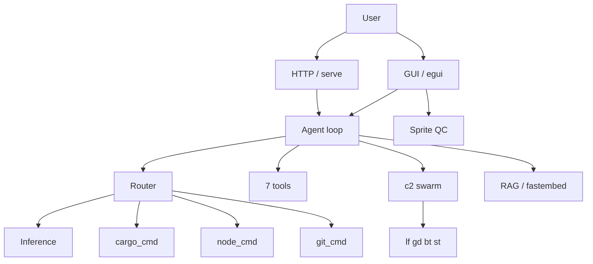

<p align="center">
  
</p>

# Kova

Augment engine. Local LLM agentic tool loop, swarm orchestration, tokenized everything.

## Proof of Artifacts

*Wire diagrams for quick review.*

### Wire / Architecture



---

## Artifacts

| Artifact | What | Lines |
|----------|------|-------|
| `src/main.rs` | CLI entrypoint. 15+ subcommands incl. tokenized `s`/`g` short forms | 1,742 |
| `src/tools.rs` | 7 tools: read, write, edit, bash, glob, grep, memory_write | 1,412 |
| `src/serve.rs` | Axum HTTP API + WebSocket streaming + embedded web client | 1,239 |
| `src/academy.rs` | Recursive academy: training, evaluation, tournament wiring | 1,072 |
| `src/gui.rs` | Native egui desktop GUI + Sprite QC integration | 896 |
| `src/node_cmd.rs` | Tokenized SSH node commands (c1-c9, ci). Parallel execution | 879 |
| `src/cargo_cmd.rs` | Tokenized cargo wrapper (x0-x9). Compressed output for AI context | 787 |
| `src/c2.rs` | Swarm orchestration: sync, build, broadcast to 4 worker nodes | 755 |
| `src/config.rs` | Config, paths, feature detection, model resolution | 662 |
| `src/git_cmd.rs` | Tokenized git commands (g0-g9). Compressed output | 448 |
| `src/sprite_qc.rs` | Tinder-style swipe UI for pixel art quality control | 383 |
| `src/inspect.rs` | Resource inspection: CPU, RAM, disk, GPU across all nodes | 317 |
| `src/trace.rs` | Execution tracing and diagnostics | 278 |
| `src/router.rs` | Intent classification and routing | 275 |
| `src/cursor_prompts.rs` | Load .cursorrules + .cursor/rules/*.mdc as system prompt | 253 |
| `src/context_loader.rs` | Project context: Cargo.toml, recent changes, git state | 227 |
| `src/agent_loop.rs` | Agentic tool loop: inference → parse → execute → feed back | 226 |
| `src/ssh_ca.rs` | SSH host CA: init, sign, setup. No host key churn | 178 |
| `src/repl.rs` | Interactive REPL. Claude Code replacement with local LLM | 175 |
| `src/inference.rs` | Local LLM inference via Kalosm (Qwen2.5-Coder GGUF) | 159 |
| `src/recent_changes.rs` | Git-based recent change detection | 135 |
| `src/storage.rs` | sled k/v store with zstd + bincode | 120 |
| `src/theme.rs` | Professional dark theme: colors, layout, styled frames | 118 |
| `src/plan.rs` | Execution planning and step resolution | 95 |
| `src/web.rs` | Embedded kova-web (egui WASM thin client) | 73 |
| `src/output.rs` | Code output formatting and diff display | 59 |
| `src/model.rs` | Model management and resolution | 46 |
| `.kova-aliases` | 97+ shell aliases for macOS + Debian. Deployed to all nodes | 263 |
| **Total** | **25,996 lines Rust + 263 lines shell across 50 source files** | **26,259** |

## Binaries

| Binary | Features | Purpose |
|--------|----------|---------|
| `kova` | gui, serve, inference | All-inclusive: REPL, GUI, HTTP, LLM, swarm, tools |
| `kova-test` | tests (exopack) | Quality gate: clippy, TRIPLE SIMS 3x, release build, smoke |

## Tokenized Command Map

### Shell Aliases (`.kova-aliases`)

```
k     = kova              ks    = serve + open browser
kc    = chat (REPL)       kg    = gui
kt    = test              kb    = bootstrap
kx0-9 = cargo tokens      kn1-9 = node tokens
kc2b  = broadcast build   kc2s  = sync all
p0-p9 = cd to project     p0b   = cd + build
```

### Cargo Tokens (`kova x`)

| Token | Command | Token | Command |
|-------|---------|-------|---------|
| x0 | build | x5 | build --release |
| x1 | check | x6 | clean |
| x2 | test | x7 | doc |
| x3 | clippy | x8 | fmt --check |
| x4 | run | x9 | bench |

### Node Tokens (`kova c2 ncmd`)

| Token | Command | Token | Command |
|-------|---------|-------|---------|
| c1 | nstat (status) | c6 | nbuild |
| c2 | nspec (specs) | c7 | nlog |
| c3 | nsvc (services) | c8 | nkill |
| c4 | nrust (rustup) | c9 | ndeploy |
| c5 | nsync | ci | compact inspect |

### Project Tokens

| Token | Project | Token | Project |
|-------|---------|-------|---------|
| p0 | kova | p5 | ronin-sites |
| p1 | approuter | p6 | kova-core |
| p2 | cochranblock | p7 | exopack |
| p3 | oakilydokily | p8 | whyyoulying |
| p4 | rogue-repo | p9 | wowasticker |

## Micro Olympics

Local LLM tournament across the cluster. 42 competitors, 6 events, 45 challenges.

**Champion: qwen2.5-coder:0.5b** (500M params, 91% accuracy, 6/7 gold medals)

Full results: [`docs/TOURNAMENT_RESULTS.md`](docs/TOURNAMENT_RESULTS.md)

Run: `kova micro tournament`

## Worker Nodes

| Token | Host | Role |
|-------|------|------|
| n0/lf | kova-legion-forge | Primary build |
| n1/gd | kova-tunnel-god | Tunnel/relay |
| n2/bt | kova-thick-beast | Heavy compute |
| n3/st | kova-elite-support | Support/backup |

## Features

```toml
default  = ["serve", "inference", "rag"]
serve    = axum + tower + tracing (+ kova-web WASM, built automatically)
gui      = eframe + egui (native desktop)
inference = kalosm + reqwest + lru
autopilot = enigo (type into Cursor)
daemon   = capnp (worker node)
tests    = exopack (quality gate)
```

## Build

```sh
cargo build                          # default (serve + inference + rag)
cargo build --release --features serve --target aarch64-apple-darwin
cargo run --features tests --bin kova-test   # quality gate
```

**Serve (web GUI):** Builds kova-web (egui→WASM) automatically. Requires:
`rustup target add wasm32-unknown-unknown` and `cargo install wasm-bindgen-cli`.

If using a workspace, remove `kova/kova-web` from `members` — kova-web is built by kova's build script.

## Setup

```sh
# Install aliases (macOS)
echo '[ -f "$HOME/.kova-aliases" ] && . "$HOME/.kova-aliases"' >> ~/.zshrc

# Deploy to worker nodes
for n in lf gd bt st; do scp .kova-aliases "$n":~/; done

# Bootstrap kova config
kova bootstrap

# Install local LLM
kova model install
```

---

Unlicense — cochranblock.org
