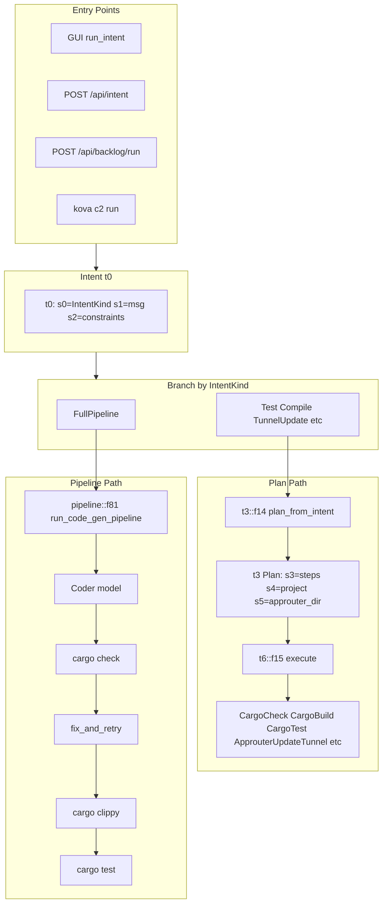

# PLAN Execution Path — Kova Architecture

**Purpose:** Document the kova PLAN execution paths: how intent flows through f14 (plan) and f15 (execute), and where the pipeline (f81) diverges for code generation.

**Reference:** compression_map.md (f14, f15, f81)

---

## Summary

Kova has **two main execution paths**:

1. **Plan path** — Intent → f14 (plan) → f15 (execute): cargo check/test/build, approuter actions. Used by GUI, serve, c2.
2. **Pipeline path** — FullPipeline → f81 (code gen pipeline): Coder → cargo check → fix loop → clippy → test. Bypasses f14/f15 for the main work.

---

## Execution Path Diagram

---

## Path 1: Plan Path (f14 → f15)

**Used when:** IntentKind is NOT FullPipeline (Test, Compile, TunnelUpdate, SetupRoguerepo, Custom, etc.)

**Flow:**

1. **t3::f14** (src/plan.rs L35–89) — Maps intent to action DAG
   - FullPipeline → `[CargoCheck, CargoTest]` (plan path uses this for non-inference)
   - Test → `[CargoTest]`
   - Compile → `[CargoCheck]` or `[CargoBuild]`
   - TunnelUpdate → `[ApprouterUpdateTunnel]`
   - SetupRoguerepo → `[ApprouterSetupRoguerepo]`
2. **t6::f15** (src/compute.rs L22–29) — Executes each step sequentially
   - For each step: f16 dispatches to `run_cargo_check`, `run_cargo_build`, `run_cargo_test`, or approuter commands
   - Uses `resolve_preset` + `cargo_cwd_args` for build presets (workspace root, -p, --target, --features)

**Callers:**

- src/gui.rs L194–196: `run_intent` (non-FullPipeline)
- src/serve.rs L522–524: `api_backlog_run` (non-FullPipeline)
- src/c2.rs L143–197: `run_command` — local: `run_local(&plan)`; broadcast: `run_broadcast(&plan, nodes)` (SSH to workers)

---

## Path 2: Pipeline Path (f81)

**Used when:** IntentKind is FullPipeline AND inference feature + coder/fix models available

**Flow:**

1. **pipeline::f81** (src/pipeline/mod.rs L38–78) — Spawns thread, returns broadcast::Receiver
2. **run_pipeline** (L80–264):
   - Load context (f82_with_recent)
   - Coder model generates Rust code
   - Loop: cargo check (temp dir) → on fail: fix_and_retry → retry
   - cargo clippy (if orchestration_run_clippy)
   - cargo test → on fail: fix_and_retry → retry
   - Write LastTrace for Explain

**Callers:**

- src/serve.rs L281–324: `api_intent` (FullPipeline) — stores rx in state, client subscribes via ws/stream
- src/serve.rs L498–514: `api_backlog_run` (FullPipeline)
- src/gui.rs L270–279: Router result CodeGen → pipeline::f81

---

## Path 3: C2 Broadcast (Plan Path on Workers)

**Used when:** `kova c2 run f18/f20 --broadcast`

**Flow:**

1. Same as Plan Path: intent → f14 → plan
2. **run_broadcast** (src/c2.rs L99–127) — For each plan step (CargoCheck, CargoBuild, CargoTest only):
   - For each node (lf, gd, bt, st): `ssh node "cd /mnt/hive/... && cargo check|build|test"`
   - Path mapping: `to_worker_path` maps ~/hive-vault → /mnt/hive

**Note:** run_broadcast does NOT run ApprouterUpdateTunnel or ApprouterSetupRoguerepo on workers (those are local-only). It only runs Cargo* actions.

---

## Key Files

| File | Role |
|------|------|
| kova-core/src/intent.rs | t0, t1, t2; f18–f23 token constructors; f62 parse_intent |
| src/plan.rs | t3, t4, t5; f14 plan_from_intent |
| src/compute.rs | t6, t7; f15 execute, f16 dispatch |
| src/pipeline/mod.rs | f81 run_code_gen_pipeline |
| src/c2.rs | run_local, run_broadcast, run_command |

---

## Intent → Plan Mapping (f14)

| IntentKind | Plan steps (s3) |
|------------|-----------------|
| FullPipeline | CargoCheck, CargoTest |
| Test | CargoTest |
| Compile { check_only: true } | CargoCheck |
| Compile { check_only: false } | CargoBuild |
| TunnelUpdate | ApprouterUpdateTunnel (if approuter_dir) |
| SetupRoguerepo | ApprouterSetupRoguerepo (if approuter_dir) |
| Custom | Custom { cmd, args } |
| CloudflarePurge, FixWarnings | (empty) |

---

## Divergence: FullPipeline

- **With inference:** Goes to pipeline::f81 (code gen). Plan path is NOT used.
- **Without inference:** Would need to fall back to plan path (f14 → f15), but `api_intent` and `api_backlog_run` return 503 when inference unavailable for FullPipeline. GUI similarly requires coder/fix models.
